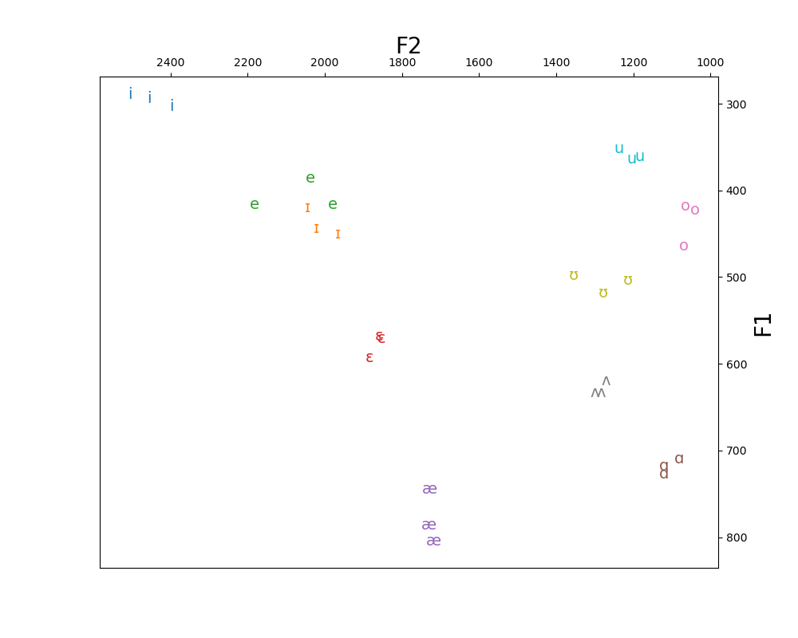

# Vowel Plotter

Extract and plot the F1 and F2 frequencies from a recording of speech.

### How to Run

First, clone the repo: 
```commandline
git clone https://github.com/TahaMHusain/vowel_plotter.git
cd vowel_plotter
```
Then set up your Python environment:

```commandline
conda env create -f environment.yml
conda activate vowel_plotter
```
* You'll need `conda` to set up the environment (it's the best way to install `montreal-forced-aligner`). For downloads and instructions, visit [www.anaconda.com](https://www.anaconda.com/)
* If the `environment.yml` file doesn't work (or solving the environment takes too long), you can build the environment on your own:
    ```commandline
    conda create -n vowel_plotter -c conda-forge python=3.10 montreal-forced-aligner matplotlib pandas
    conda activate vowel_plotter
    pip install praat-parselmouth
    ```
You can then test the environment by running on sample data:
```commandline
python vowel_plotter.py data/sample_vowels.wav
```

After a minute or so, you should see a multicolored chart like this appear in a new window (and saved as `data/vowel_plot.png`):



## Plot your own vowels
To plot your own vowels, first record yourself saying the following words three times each.

|   |   |   |   |   |   |   |   |   |   |
|---|---|---|---|---|---|---|---|---|---|
| beat  |  bit | bait | bet | bat | bot | boat | but | book | boot |

Make sure to speak slowly and clearly, with pauses in between words. Listen to `data/sample_vowels.wav` for an example.

Save the recording as a `.wav` file, then run `vowel_plotter.py` :
```commandline
python vowel_plotter.py path/to/recording.wav
```


